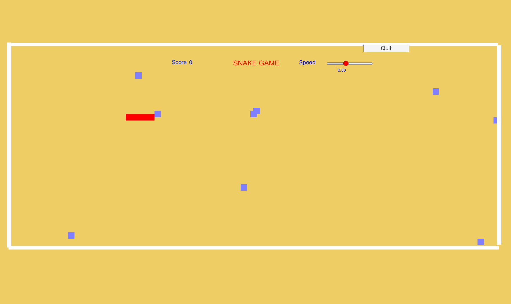
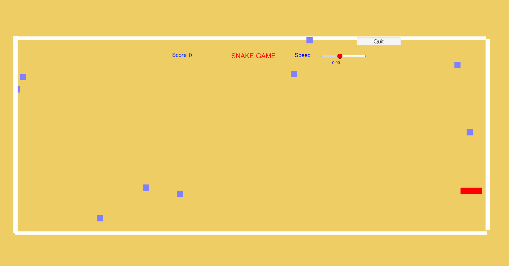

<h1 align="center">Snake-Game_UnityEngine</h1>

  <b>Project - Computer Game Development and Animation , <a href="https://nitw.ac.in/">NITW</a> (Winter 2021)</b>

## 📝 About The Project
For those of you not familiar with Snake game, it's a game where Snake (Moving Square Which moves from head side) moves around in a Open Field With Border and tries to eat as many food pellets (the small dots) as possible, while avoiding to Eat his own Body or we say tail. This Game is Based on how much high score you can do it can keep going on for hours even you can manage speed of food generation and speed of snake.

## ☁️ Overview
In this project, the Snake will Move inside the border area, And it have to eat foods moving around. I implemented general Moving algorithm with keyboard keys and algo which keep track of score and increase of size of snake.

## 💻 Language and Tools Used
C# - For Coding Part and Libraries. 
Visual Studio Code - Text Editor For Running C# Codes. 
Unity Engine - For Handling Scripts with Runnable Environment. 

## 💾 Project Files Description
Scripts/SpawnFood.cs - Here how and where food will generate with what speed resides. 
Scripts/LiveScoreScript.cs - This Maintains the Score Increment With Every Food is Eaten. 
Scripts/Snake.cs - This Binds All Scripts and also Handle Movement of Snake and Growth rate of Snake. 
Scripts/SceneLoader.cs -  this Helps to Load scene or Quit Game. 

## ⏯️ How to Run Game
STEP-1 - To Download Source Code and Playable Build click(https://drive.google.com/drive/folders/1Aeiwm-NYEDG-VxkZVJBNHitLlna0a2yJ?usp=sharing). 
STEP-2 - Extract the **Snake Game playable(.exe).zip** for Playable Content and **Snake Game Source Code.zip** to see Source Code Content. 
STEP-3 - Open Extracted Folder Than double Click on **Snake.exe** to play game. 
STEP-4 - Enjoy the Game!. 

